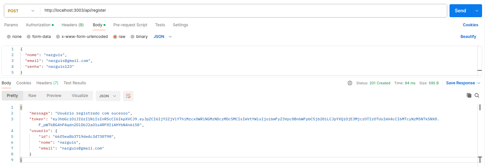
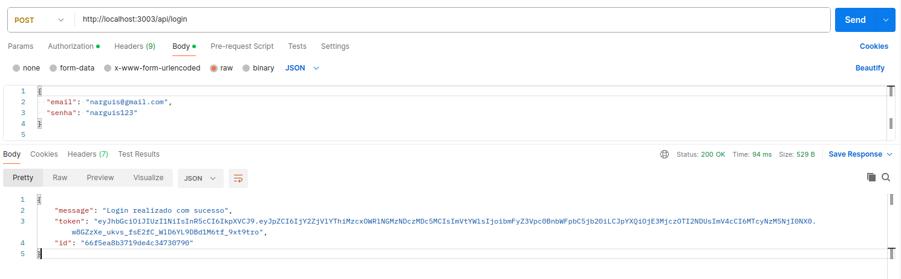
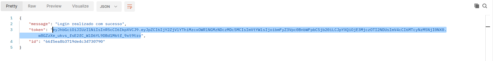
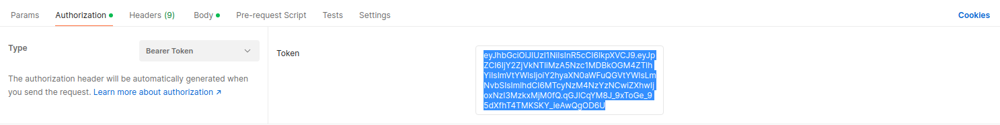
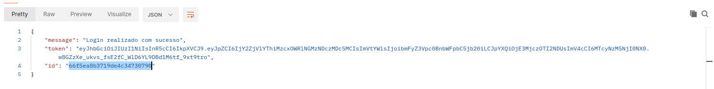

# FitFriend API

A API deste repositório foi desenvolvida com base no aplicativo imaginário FitFriend, que foi prototipado na disciplina de Engenharia de Software 1, lecionada pelo Professor Leandro Vaguetti no Instituto Federal de Brasília - Campus Taguatinga.

A API representa o back end dessa aplicação e contém as rotas, models, DAOs, controllers, services e um banco de dados com sistema de autenticação via JWT.


## Modelos

Os modelos representados na API são:

#### Usuario

**Propriedades:**

- ID
- Nome
- E-mail
- Senha

**Métodos:**

- obterMetricas()
- obterTreinos()
- registrarFrequencia()

#### Metricas

Cada usuário possui um conjunto de métricas corporais

**Propriedades:**

- Altura
- Peso
- IMC
- BF
- Agua

#### Treino

Cada usuário pode possuir múltiplos treinos

**Propriedades:**

- ID
- Descricao
- Exercicios

#### FrequenciaAcademia

Cada usuário pode possuir múltiplas frequências

**Propriedades:**

- ID
- Data
- TreinoRealizado


## Requisitos

- Node.js
- MongoDB

[Guia para instalar o MongoDB no Ubuntu](https://www.mongodb.com/pt-br/docs/manual/tutorial/install-mongodb-on-ubuntu/)


## Instalação

1. Clone o repositório
```bash
git clone git@github.com:narguis/Engenharia-de-Software-2-Etapa-Avaliativa-3.git
```

2. Navegue até o repositório e instale as dependências
```bash
cd Engenharia-de-Software-2-Etapa-Avaliativa-3
npm install
```

3. Gere um Secret JWT
```bash
node -e "console.log(require('crypto').randomBytes(64).toString('hex'));"
```

4. Adicione o Secret ao arquivo `.env exemplo` na raíz do projeto, altere as ports caso necessário e renomeie o arquivo para `.env`


## Uso

1. Inicie o MongoDB
```bash
systemctl start mongod
```

2. Inicie o servidor
```bash
npm start
```

3. O terminal deve exibir as mensagens
```bash
Servidor rodando na porta 3000
Conectado ao MongoDB
```

4. Acesse a API em `http://localhost:3000` (ou na PORT escolhida)


## Telas e Endpoints

Para fins de exemplo, o Postman será utilizado para acessar os endpoints da API.

Os parâmetros de cada requisição podem ser enviados em formato JSON no corpo da requisição, e aqueles que necessitam de autorização, irão utilizar, na aba de Authorization, o Bearer Token que será gerado.


### Tela de Cadastro e Login

##### Descrição das telas

- Tela de cadastro
Campos: Nome, email, senha
Botões: Cadastrar

- Tela de login
Campos: Email, senha
Botões: Login

##### Rotas

- POST /api/register

Requer os parâmetros `nome`, `email`(único) e `senha`. Não requer autorização.

Retorna os parâmetros `token` e `id`, que devem ser armazenados para utilizar os outros endpoints.




- POST /api/login

Requer os parâmetros `email` e `senha`. Não requer autorização.

Retorna os parâmetros `token` e `id`, que devem ser armazenados para utilizar os outros endpoints.



**Todas as rotas abaixo requerem autorização. Para isso, pode-se copiar o `token` retornado na requisição de login**



**e utilizá-lo como `Bearer Token` na aba `Authorization`**



**O trecho `:id` na rota deve ser substituído pelo `id` que é retornado na requisição de login** 




### Telas do Usuário

##### Descrição das telas

- Tela de perfil do usuário
Exibe: Dados do usuário, métricas, treinos e frequência
Botôes: Editar, Remover

##### Rotas

- GET /api/usuarios/:id: Exibe o usuário

- PUT /api/usuarios/:id: Atualiza o usuário

- DELETE /api/usuarios/:id: Deleta o usuário


### Telas de Treino

##### Descrição da Tela

- Tela de treinos
Exibe: Lista de treinos do usuário
Botões: Adicionar, Editar, Remover

##### Rotas

- POST /api/treinos: Cria um treino

- GET /api/treinos: Obtém todos os treinos

- GET /api/treinos/:id: Obtém treino por ID

- PUT /api/treinos/:id: Atualiza o treino

- DELETE /api/treinos/:id: Deleta o treino


### Telas de Métricas

##### Descrição das telas

- Tela de métricas
Exibe: Métricas corporais do usuário
Botões: Editar

##### Rotas

- GET /api/metricas/:user_id: Obtém todas as métricas

- PUT /api/metricas/:metrica_id: Atualiza a métrica


### Telas de Frequência

##### Descrição das telas

- Tela de registro de frequência
Campos: Data, Treino Realizado
Botões: Registrar Frequência

- Calendário de frequências
Exibe: Frequências do usuário
Botões: Editar, Deletar

##### Rotas

- POST /api/frequencia: Registra a frequência

- GET /api/frequencia: Obtém todas as frequências

- GET /api/frequencia/:id: Obtém a frequência

- PUT /api/frequencia/:id: Atualiza a frequência

- DELETE /api/frequencia/:id: Deleta a frequência

